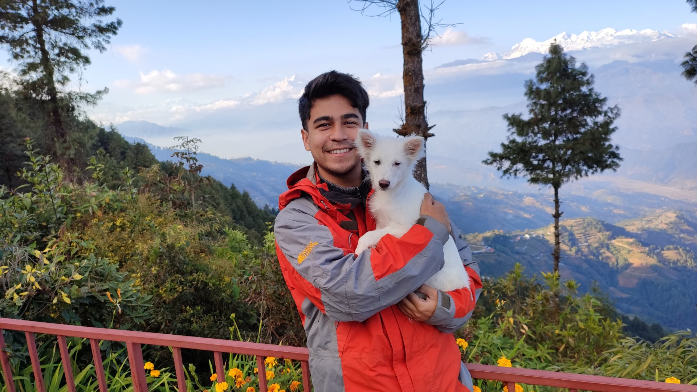

# Saurav Amatya - A Journey in Tech

## Introduction

Hello, I'm Saurav Amatya, second year IT student at Centria UAS, Finland and here you cand find my story where I present my passions, interests , skills, experiences ,aspirations and  future goals.

## Passion

My journey began with C and C++ although until I started learning Java I had not stepped into development and understanding the software design. The intricacies of code and the art of crafting solutions to real world problems have always fascinated me. There's an indescribable thrill in transforming an idea into a functional system. 

## Interests

My interests span a wide range of technologies and tools, from web development with HTML/CSS and JavaScript, C# .Net to mobile app development for Android. I've interested to learn more about front end development, which is a mixture of creative art and programming. The dynamic world of programming and the ever growing new technologies really fascinates me. 

**Beyond Coding:** 
My hobbies are hiking , singing , playing music on guitar and yoga. They keep me calm and happy whenever I am stressed. These activities serve as my refuge in times of stress, providing solace and happiness. Before a coder I am a human and I need my peace of mind.

## Aspirations

**Staying Ahead:** In the rapidly evolving tech world, my passion for staying at the forefront of innovation keeps me engaged and excited about the future. Merging my passions and interests with my career has been a fulfilling journey.

**Challenges Await:** System design, creating business logic from scratch, and deciding which technology to use are intricate decisions. My collaboration with innovative teams brings joy, as there are numerous ways to solve the same problem.

## Projects

**Projects Done:** I've had the privilege of working on International projects with Polar Electro Oy, developing Android application.

**Projects Doing Currently:** I'm currently working on an international project with collaboration with a German university, designing a logistics system for Ahola Digital Oy. This experience has provided valuable insights into collaboration and various software design methodologies and technology industry standards.

## Future Aspirations

I'm eagerly learning React for frontend development and expanding my expertise in web application development. My goal is to encompass the entire spectrum of this field as currently I have mostly worked in backend.

## Skills

My skill set includes C#, ASP, .NET, REST API, SOAP API, SQL Server, JavaScript, HTML/CSS, Java, GIT, FinTech, Web Services, Azure DevOps, Linux, Android. My exploration extends beyond coding. I've dived into the world of database design and management and have practiced software testing using tools like Postman and Swagger.

For more details about my projects and skills, you can explore my [GitHub Repository](https://github.com/saumatya).

# Project: Carbon Footprint Tracker for Wear OS Smartwatch

## Overview

I had the privilege of working on an international project with Polar Electro Oy in Kempele, Finland. The project's objective was to develop a smartwatch application for Wear OS, using Android and Java. This application aimed to enable users to track their carbon footprint, fostering environmental awareness and encouraging sustainable living.

## Technical Details

- **Platform**: Wear OS, Android Native
- **Programming Language**: Java
- **Backend Data Persistence**: Online Database; Cloud Firestore

## Project Goals

The primary goal of this project was to empower users to make informed decisions to reduce their carbon footprint. This was achieved through the following key components:

1. **Smartwatch Application**: I developed a user-friendly and intuitive smartwatch application that allowed users to track their daily activities.

2. **Online Database**: The project featured a robust online database that facilitated data persistence and enabled users to access and monitor their carbon emissions.

3. **Carbon Emission Tracking**: Users could input data related to their activities, and the application calculated their carbon emissions, providing valuable insights into their environmental impact.

## Impact

This project was not just a technological endeavor but a meaningful contribution to environmental sustainability. It encouraged individuals to make eco-conscious choices by providing them with real-time data about their carbon footprint. This data-driven approach aimed to motivate users to be more environmentally responsible.

## Project Resources

- [GitHub Repository](https://github.com/saumatya/Polar-Smartwatch-App): For access to the project's source code and files.
- [Project Report](https://centriafi-my.sharepoint.com/:b:/g/personal/saurav_amatya_centria_fi/EdDh__5O6ixPm6Oq5BEfrh0B6NMLvUp52xzOYY06EiL2lQ?e=g29QXE): To read the detailed project report and findings.

## Conclusion

The project with Polar Electro Oy serves as an excellent example of combining technology and sustainability. It showcases my ability to leverage my technical skills to create a tool that makes a positive impact on the world. This experience continues to inspire me to undertake projects that align with my passions and skills to drive positive change.

